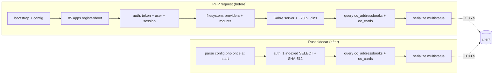
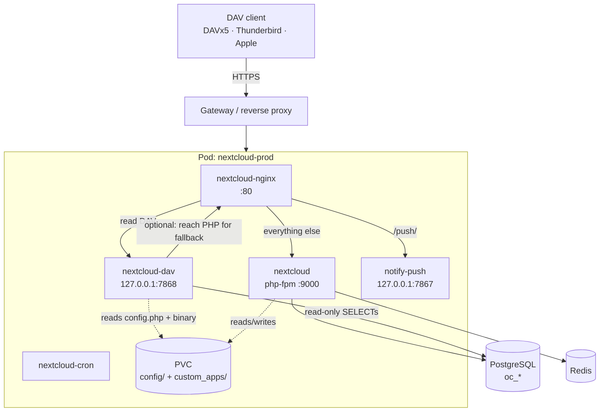
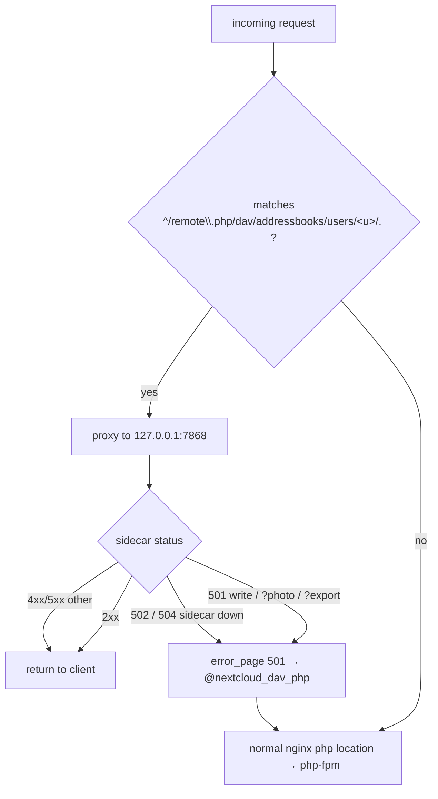
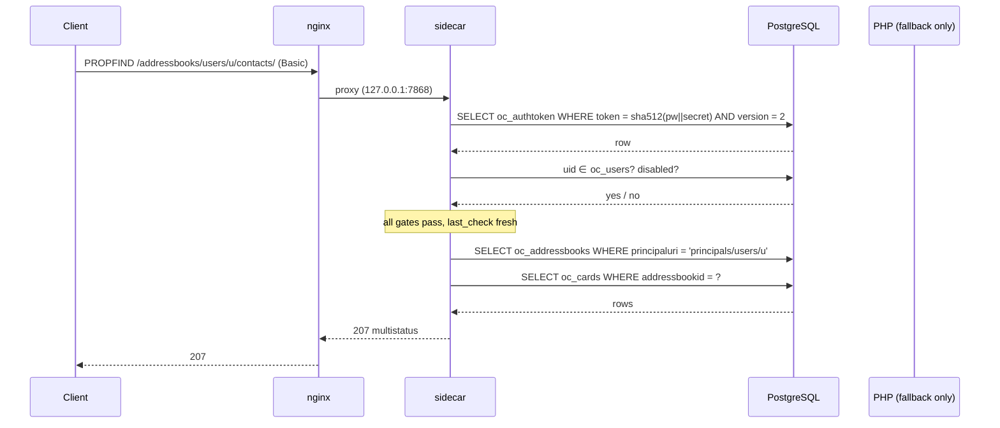
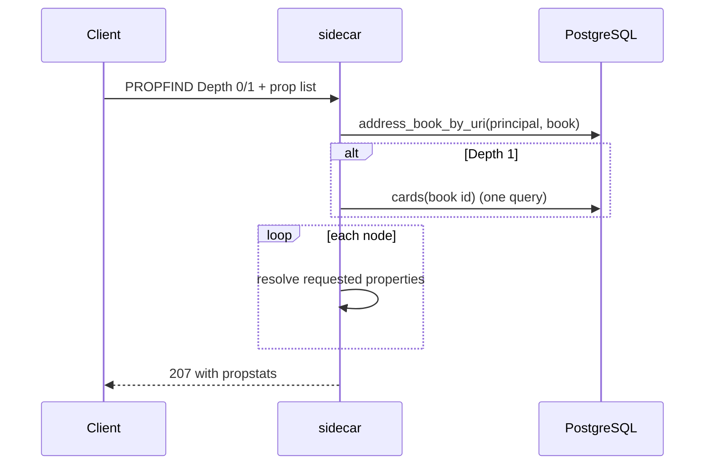
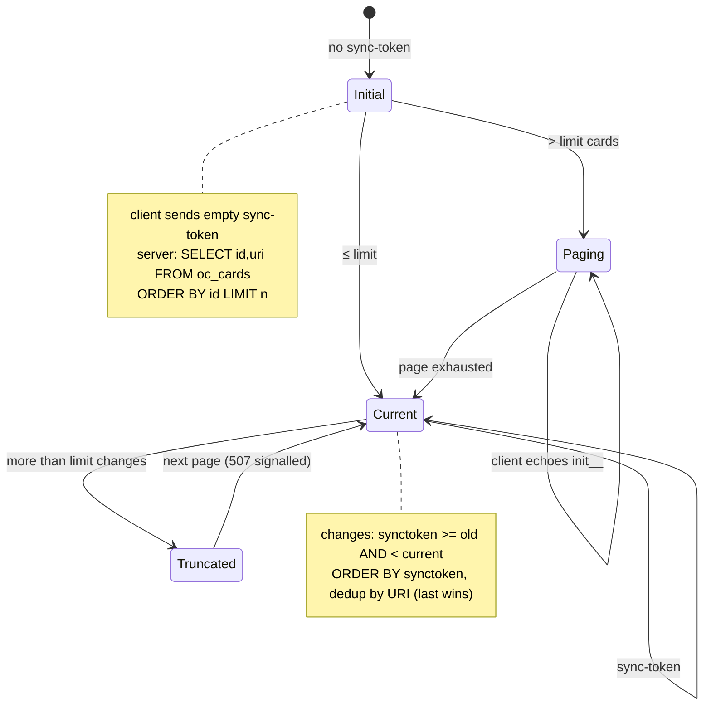
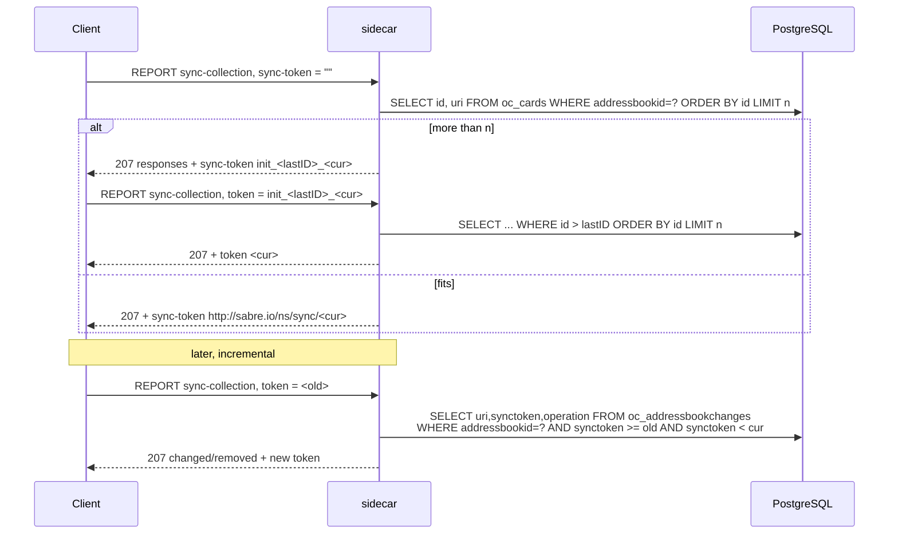
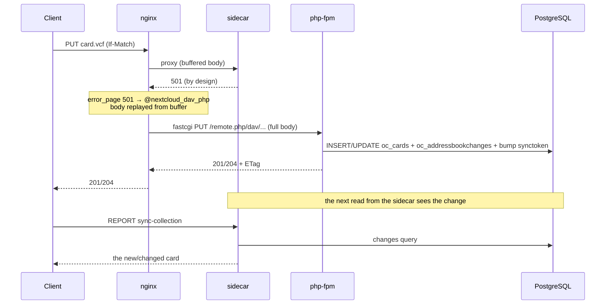
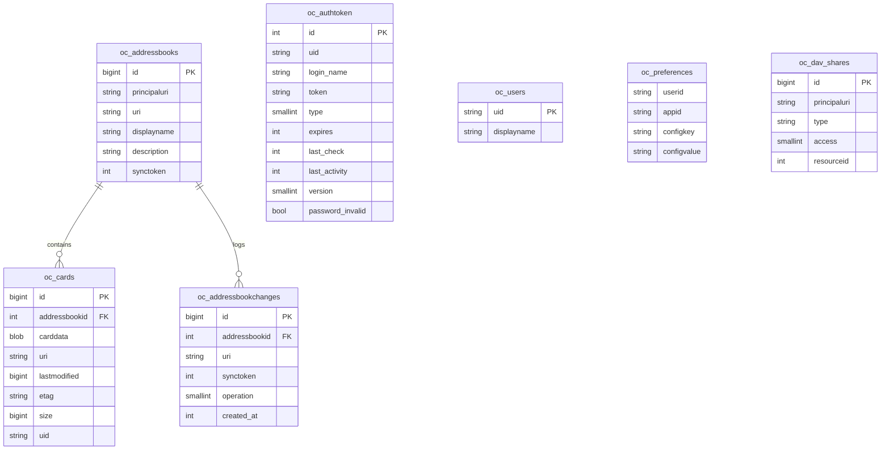
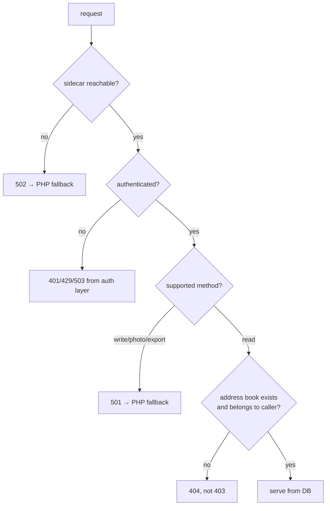

# nextcloud-dav — architecture

A read-only CardDAV sidecar for Nextcloud that serves
`/remote.php/dav/addressbooks/users/<user>/**` directly from the Nextcloud
database, bypassing the PHP stack for steady-state sync traffic. Writes and
anything else fall back to PHP through nginx.

This document is the as-built design. The reasoning that led here (measurements,
rejected alternatives) is in the sibling `../dav-bench/` documents; the API
surface it was verified against is Nextcloud 33.0.5 / SabreDAV 4.7.

---

## 1. Why it exists

Measured on the production instance, a CardDAV request through PHP cost
**~1.3–1.4 s** regardless of collection size, almost all of it *fixed*:
Nextcloud bootstrap, authentication/session setup, filesystem/mount setup
(~700 ms: GroupFolders 268 ms, files_sharing 150 ms, files_external 109 ms) and
the Sabre plugin stack. App boot itself is only ~20–40 ms, so the cost is not
"PHP is slow" but "PHP rebuilds a very large object graph per request".

An address book is tiny (hundreds of rows). Serving it from a process that does
*only* auth + two indexed queries removes almost all of that.



---

## 2. Deployment topology

The sidecar runs as an ordinary extra container **in the same pod** as
Nextcloud. That removes the need to distribute an image: the static binary is
dropped on the existing Nextcloud PVC and executed from an `alpine` container,
exactly like `notify_push`. It listens on loopback only; nginx proxies to it.



The binary lives at `custom_apps/nextcloud_dav/bin/nextcloud-dav`. It is built
by `Dockerfile` (multi-stage `rust:alpine` → static musl) and copied onto the
PVC; see §12 for the deploy procedure and its pitfalls.

---

## 3. Request routing

Only paths **below** an address-book home go to Rust. The home itself stays on
PHP on purpose: PHP also advertises the app-generated collections
(`z-server-generated--system`, `z-app-generated--contactsinteraction--recent`)
that the sidecar does not model, and discovery happens once per client.



Key properties of the nginx configuration that make this safe:

- **Regex, not `^~`.** `^~` would shadow the regex PHP location and swallow the
  home too. The regex requires at least one more path segment after
  `users/<u>/`, so the home falls through to `location ~ \.php`.
- **`proxy_intercept_errors on` + `error_page 501 502 504`.** Without
  interception, an upstream 501 is passed to the client verbatim.
- **`proxy_request_buffering on` (the default).** This is load-bearing: an
  `error_page` fallback is an *internal redirect*, and if the request body was
  streamed (buffering off) it is gone by then — PHP then sees an empty body and
  `PUT` would be corrupted. Buffering keeps the body replayable. Card bodies are
  small, so the cost is negligible.
- The named fallback location re-runs `fastcgi_split_path_info`; `error_page`
  preserves `$uri`, so it resolves `/remote.php` + `/dav/...` for PHP.

---

## 4. Authentication

Nextcloud app passwords are opaque tokens. The stored form is
`sha512(token || config.secret)` (`PublicKeyTokenProvider::hashToken()`), which
means a process holding `config.php` and the DB can validate one **without
PHP** — one indexed `SELECT` and one SHA-512.

```mermaid
flowchart TD
  A[Basic credentials] --> B{bruteforce enabled?}
  B -- yes --> B1[count failed logins for /32 or /56 subnet<br/>sleep 0.1·2^n ms, block over threshold]
  B -- no --> C
  B1 --> C[h = hex sha512 password + secret]
  C --> D[SELECT ... FROM oc_authtoken<br/>WHERE token = h AND version = 2]
  D --> E{row found?}
  E -- no --> F[retry with sha512 password<br/>legacy empty-secret instances]
  F --> G{row found?}
  G -- no --> FB[PHP fallback]
  E -- yes --> H{type ∈ {1,3}?}
  H -- no --> FB
  H -- yes --> I{expired? password_invalid?}
  I -- invalid --> REJ[401]
  I -- expired --> FB
  I -- ok --> J{login_name matches<br/>and uid ∈ oc_users?}
  J -- no --> REJ
  J -- non-native user --> FB
  J -- yes --> K{user disabled?}
  K -- yes --> REJ
  K -- no --> L{last_check older than 300 s?}
  L -- yes --> FB
  L -- no --> OK[authenticated: FastPath]
  FB --> PHP[credentialed PROPFIND /remote.php/dav/]
  PHP --> M{status}
  M -- 207 --> OK2[authenticated: PhpFallback<br/>PHP also refreshes last_check]
  M -- 401 --> REJ
  M -- 503 --> MAINT[503 maintenance]
  M -- 429 --> THR[429 throttled]
```

Why the gates exist, mirrored from `PublicKeyTokenMapper` and
`OC\User\Session`:

| gate | reason |
|---|---|
| `version = 2` | `PublicKeyTokenMapper` filters on `PublicKeyToken::VERSION`; v2 on NC 33 and 36. **Getting this wrong makes every request silently fall back to PHP.** |
| `type ∈ {1,3}` | `PERMANENT` / `ONETIME`; `WIPE_TOKEN` (2) is a revocation marker. |
| `login_name` match | `validateTokenLoginName()`: an app password only works with the login name it was minted under. |
| `uid ∈ oc_users` | LDAP/SSO users are not native; their password checker lives in PHP. |
| disabled flag | `oc_preferences` `core/enabled = false`. |
| `last_check` ≤ 300 s | `checkTokenCredentials()` re-validates against the real backend every 5 min; the sidecar delegates rather than skips it, so the revocation window does not widen. |

A deliberate, configurable deviation: `record_bruteforce_attempts` defaults to
**false**, so the shipped sidecar is strictly read-only and the PHP fallback is
what records failures. The delay/block *checks* always run.



---

## 5. Read path

### 5.1 PROPFIND



Properties served include `{DAV:}resourcetype`, `displayname`,
`{carddav}addressbook-description`, `{cs}getctag`, `{sabredav}sync-token`,
`{DAV:}sync-token`, `supported-report-set`, `max-resource-size`,
`supported-address-data`, `supported-collation-set`, `owner`,
`current-user-privilege-set`, `{oc}groups`, `{nc}owner-displayname`,
`{nc}has-photo`, and per card `getetag` / `getcontentlength` /
`getlastmodified` / `getcontenttype` / `{carddav}address-data`.

### 5.2 GET

The card body is the raw `oc_cards.carddata`, with the same non-image
`PHOTO:data:` filtering Nextcloud applies on read (`readBlob`), and the stored
ETag quoted. Verified byte-identical to PHP for 40/40 sampled cards.

### 5.3 REPORT

- `addressbook-multiget` — resolve hrefs, one query, 404 propstats for misses.
- `addressbook-query` — RFC 6352 §10.5 filters evaluated in Rust over the
  fetched vCards. `oc_cards_properties` is **not** used as the source of truth
  (it only truncates to 254 bytes and indexes a fixed property list).
- `sync-collection` — RFC 6578, below.

---

## 6. Sync tokens (RFC 6578)

Nextcloud's token scheme is unusual and the sidecar reproduces it exactly:
`oc_addressbooks.synctoken` is always *max(`addressbookchanges.synctoken`)+1*,
and each change row carries the **pre-increment** token. The wire form is
`http://sabre.io/ns/sync/<n>`.





A `507` is emitted when a page is truncated, matching Sabre. A malformed
(token missing the prefix) yields `400`.

---

## 7. Write path — the hybrid boundary

v1 is read-only. Writes are answered `501` on purpose and repelled back to PHP
by nginx. Because both sides share the same database, the sidecar sees PHP's
writes immediately; this is the property that makes the hybrid safe, and it is
tested end-to-end (see `../dav-bench/CARDDAV_LIVE.md`).



---

## 8. Data model

Only a handful of tables are read. There is **no `oc_principals` table** —
principals are computed from `oc_users` / `oc_group_user` / `oc_accounts`.



`oc_cards.etag` is an unquoted `md5(carddata)` and is quoted on output.
`oc_cards_properties` exists but is used by Nextcloud's Contacts/OCS search,
**not** by DAV `addressbook-query`.

---

## 9. Caching and consistency

The v1 sidecar holds **no cache**: every request re-reads the DB. That is
deliberate — it is what makes "PHP writes, Rust reads" trivially consistent, and
the queries are indexed (`fs_parent`, `cards_abiduri`, the authtoken unique
index on `token`). The connection pool is the only long-lived state.

The cost of that choice is re-reading rows on every request; the benefit is that
there is no invalidation logic to get wrong and no stale-window on a write.

---

## 10. Failure and fallback behaviour



Denied or unknown resources return **404, not 403**, matching Nextcloud's
`DavAclPlugin` (it hides existence). Requests for another user's home/book/card
are rejected before any query, and every query is scoped to
`principals/users/<authenticated uid>`.

---

## 11. What the sidecar deliberately does not do

- Writes (`PUT`, `DELETE`, `MKCOL`, `PROPPATCH`, `MOVE`, `COPY`, `POST`) → 501.
- `?photo` (appdata + GD) and `?export` (concatenated vCard) → 501.
- Shared / group / **system** address books, and the app-generated
  `contactsinteraction` book → served by PHP (and the home listing always is).
- vCard 3↔4 negotiation for `address-data`, conditional GET, `allprop`
  completeness → not implemented.
- Brute-force attempt recording → off by default.

---

## 12. Operations

**Build and place the binary** (no image distribution, mirrors `notify_push`):

```sh
docker build -t nextcloud-dav:build .
docker create --name ndav nextcloud-dav:build
docker cp ndav:/usr/local/bin/nextcloud-dav ./nextcloud-dav-static
docker rm ndav
kubectl -n nextcloud cp -c nextcloud ./nextcloud-dav-static \
  <pod>:/var/www/html/custom_apps/nextcloud_dav/bin/nextcloud-dav
kubectl -n nextcloud exec <pod> -c nextcloud -- chmod 755 /var/www/html/custom_apps/nextcloud_dav/bin/nextcloud-dav
```

**Restart only the sidecar** after swapping the binary (no pod restart):

```sh
kubectl -n nextcloud exec <pod> -c nextcloud-dav -- kill 1
```

**Pitfalls learned the hard way**

| pitfall | consequence | rule |
|---|---|---|
| kubelet `httpGet` probe on a loopback listener | probe hits the pod IP, fails, CrashLoop | use an `exec` probe (`wget -qO- http://127.0.0.1:7868/healthz`) |
| Deployment strategy is `Recreate` | every manifest change is downtime (~80 s) | prefer binary swap + container restart; schedule changes deliberately |
| ConfigMap change alone | nginx keeps the old config | wait for the kubelet volume sync, then `nginx -s reload` |
| `proxy_request_buffering off` | `error_page` fallback gets an empty body | keep buffering on |
| `^~` prefix location | shadows the PHP location, home listing served by Rust | use the sub-path regex |
| `oc_authtoken` version mismatch | silent PHP fallback, no speed-up | assert the fast path, don't trust 207s |

---

## 13. Measured outcome

Public HTTPS, same credentials, same data, 788-card address book:

| request | PHP | sidecar |
|---|---|---|
| PROPFIND Depth 1 (788 cards) | 1.34–1.41 s | **0.080–0.094 s** |
| PROPFIND Depth 0 (home) | ~1.3 s | **0.030 s** |
| GET card | ~1.3 s | **0.043 s** |
| DAV root, files, calendars | ~1.2 s | unchanged (PHP) |

Content parity: 789 hrefs and 788 ETags identical between backends, 0 differing
values; bodies byte-identical; minified payload differs by 57 bytes (whitespace).

**Known deviation:** for some cards PHP's *GET* returns a weak ETag (`W/"..."`)
while its own *PROPFIND* returns the strong form; the sidecar matches the
PROPFIND form. Bodies are identical. Accepted.

Latency is load-dependent: the same request measured 0.08 s and, under node
memory pressure, 2.18 s (PHP 3.29 s) — the ratio holds, the absolute number
tracks DB I/O contention, not the sidecar.
