# nextcloud-dav — architecture

A CardDAV sidecar for Nextcloud that serves
`/remote.php/dav/addressbooks/users/<user>/**` directly from the Nextcloud
database, bypassing the PHP stack for steady-state sync traffic. Reads are
served from PostgreSQL; card `PUT`/`DELETE` are handled natively too, with the
PHP event side effects dispatched asynchronously from a transactional outbox.
Anything else still falls back to PHP through nginx.

This document is the as-built design. The reasoning that led here (measurements,
rejected alternatives) is in the sibling `../dav-bench/` documents; the API
surface it was verified against is Nextcloud 33.0.5 / SabreDAV 4.7.

---

## 1. Why it exists

Measured on the production instance, a CardDAV request through PHP cost
**~1.3–1.4 s** regardless of collection size, almost all of it *fixed*:
Nextcloud bootstrap, authentication/session setup, filesystem/mount setup
(~700 ms: GroupFolders 268 ms, files_sharing 150 ms, files_external 109 ms) and
the Sabre plugin stack. App boot itself is only ~20–40 ms, so the cost is not
"PHP is slow" but "PHP rebuilds a very large object graph per request".

An address book is tiny (hundreds of rows). Serving it from a process that does
*only* auth + two indexed queries removes almost all of that.

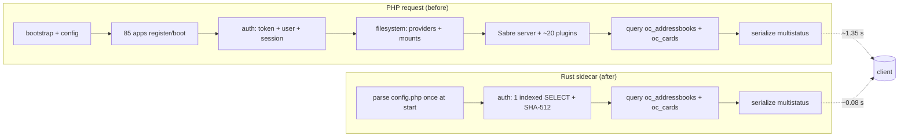

---

## 2. Deployment topology

The sidecar runs as an ordinary extra container **in the same pod** as
Nextcloud. That removes the need to distribute an image: the static binary is
dropped on the existing Nextcloud PVC and executed from an `alpine` container,
exactly like `notify_push`. It listens on loopback only; nginx proxies to it.

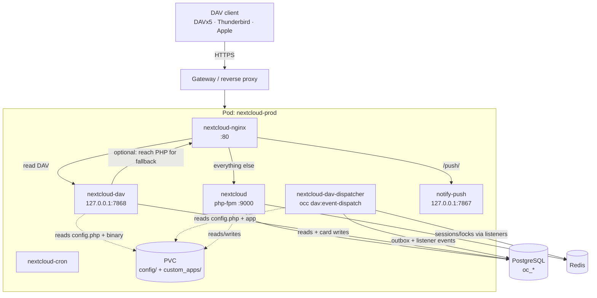

The binary lives at `custom_apps/nextcloud_dav/bin/nextcloud-dav`. It is built
by `Dockerfile` (multi-stage `rust:alpine` → static musl) and copied onto the
PVC; see §12 for the deploy procedure and its pitfalls.

The **dispatcher** (`nextcloud_dav-dispatcher`) is a separate container because
the sidecar's `alpine` image has no PHP: it runs the companion app's worker
against the same PVC and database, and is the only thing that runs PHP
event listeners on the write path (§7.2).

---

## 3. Request routing

Only paths **below** an address-book home go to Rust. The home itself stays on
PHP on purpose: PHP also advertises the app-generated collections
(`z-server-generated--system`, `z-app-generated--contactsinteraction--recent`)
that the sidecar does not model, and discovery happens once per client.

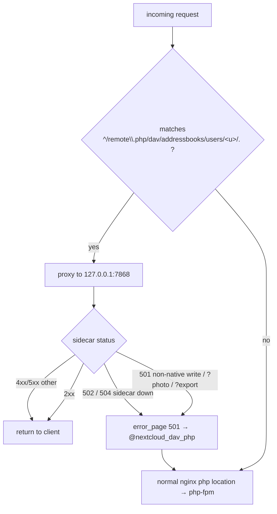

Key properties of the nginx configuration that make this safe:

- **Regex, not `^~`.** `^~` would shadow the regex PHP location and swallow the
  home too. The regex requires at least one more path segment after
  `users/<u>/`, so the home falls through to `location ~ \.php`.
- **`proxy_intercept_errors on` + `error_page 501 502 504`.** Without
  interception, an upstream 501 is passed to the client verbatim.
- **`proxy_request_buffering on` (the default).** This is load-bearing: an
  `error_page` fallback is an *internal redirect*, and if the request body was
  streamed (buffering off) it is gone by then — PHP then sees an empty body and
  `PUT` would be corrupted. Buffering keeps the body replayable. Card bodies are
  small, so the cost is negligible.
- The named fallback location re-runs `fastcgi_split_path_info`; `error_page`
  preserves `$uri`, so it resolves `/remote.php` + `/dav/...` for PHP.

---

## 4. Authentication

Nextcloud app passwords are opaque tokens. The stored form is
`sha512(token || config.secret)` (`PublicKeyTokenProvider::hashToken()`), which
means a process holding `config.php` and the DB can validate one **without
PHP** — one indexed `SELECT` and one SHA-512.

```mermaid
flowchart TD
  A[Basic credentials] --> B{bruteforce enabled?}
  B -- yes --> B1[count failed logins for /32 or /56 subnet<br/>sleep 0.1·2^n ms, block over threshold]
  B -- no --> C
  B1 --> C[h = hex sha512 password + secret]
  C --> D[SELECT ... FROM oc_authtoken<br/>WHERE token = h AND version = 2]
  D --> E{row found?}
  E -- no --> F[retry with sha512 password<br/>legacy empty-secret instances]
  F --> G{row found?}
  G -- no --> FB[PHP fallback]
  E -- yes --> H{type ∈ {1,3}?}
  H -- no --> FB
  H -- yes --> I{expired? password_invalid?}
  I -- invalid --> REJ[401]
  I -- expired --> FB
  I -- ok --> J{login_name matches<br/>and uid ∈ oc_users?}
  J -- no --> REJ
  J -- non-native user --> FB
  J -- yes --> K{user disabled?}
  K -- yes --> REJ
  K -- no --> L{last_check older than 300 s?}
  L -- yes --> FB
  L -- no --> OK[authenticated: FastPath]
  FB --> PHP[credentialed PROPFIND /remote.php/dav/]
  PHP --> M{status}
  M -- 207 --> OK2[authenticated: PhpFallback<br/>PHP also refreshes last_check]
  M -- 401 --> REJ
  M -- 503 --> MAINT[503 maintenance]
  M -- 429 --> THR[429 throttled]
```

Why the gates exist, mirrored from `PublicKeyTokenMapper` and
`OC\User\Session`:

| gate | reason |
|---|---|
| `version = 2` | `PublicKeyTokenMapper` filters on `PublicKeyToken::VERSION`; v2 on NC 33 and 36. **Getting this wrong makes every request silently fall back to PHP.** |
| `type ∈ {1,3}` | `PERMANENT` / `ONETIME`; `WIPE_TOKEN` (2) is a revocation marker. |
| `login_name` match | `validateTokenLoginName()`: an app password only works with the login name it was minted under. |
| `uid ∈ oc_users` | LDAP/SSO users are not native; their password checker lives in PHP. |
| disabled flag | `oc_preferences` `core/enabled = false`. |
| `last_check` ≤ 300 s | `checkTokenCredentials()` re-validates against the real backend every 5 min; the sidecar delegates rather than skips it, so the revocation window does not widen. |

A deliberate, configurable deviation: `record_bruteforce_attempts` defaults to
**false**, so the sidecar never records a failed login and the PHP fallback is
what does. The delay/block *checks* always run.

### Session-cookie authentication (the web UI)

When `nextcloud_dav.session_redis_url` is set (the same value PHP has in
`session.save_path`), the sidecar also evaluates the Nextcloud **session
cookie**, which is how the web UI talks to DAV: `oc_sessionPassphrase` is a
random passphrase and the session id cookie (named after `$CONFIG['instanceid']`)
points at `PHPREDIS_SESSION:<id>` in redis. The stored value is an igbinary
array holding the ciphertext produced by `OC\Security\Crypto`:

1. `keyMaterial = HKDF-SHA512(passphrase)` (64 bytes), split into a 32-byte
   encryption key and a 32-byte MAC key;
2. the HMAC-SHA512 key is the **ASCII hex** of `sha512(macKey || 'a')` and the
   message is `ciphertext_hex || iv_hex`, compared in constant time;
3. the AES-128-CBC key is `PBKDF2-SHA1(encKey, "phpseclib", 1000, 16)` and the
   IV is the envelope's, then PKCS#7 is unpadded;
4. the plaintext is JSON.

Every step is reproduced in `src/auth/session.rs` and pinned against a
blob produced by PHP's own `OC\Security\Crypto` in the harness. The decision is
the ordered one of `docs/recon/session-auth.md` §6: cookie pair -> redis ->
crypto/JSON -> `user_id` -> native+enabled user -> `Session::validateSession()`
token revalidation (the session's `app_password`, else the session id) -> 2FA
(an app-password session skips it; otherwise `two_factor_auth_passed` must name
the user) -> the two `Auth.php` acceptance branches, including PHP's CSRF rule
(`requesttoken` + strict/lax same-site cookies) for a session without
`AUTHENTICATED_TO_DAV_BACKEND`. **Anything that cannot be evaluated exactly is
delegated**, never accepted.

A browser form-login session stores no `app_password` and its session token is
`TEMPORARY_TOKEN` (type 0), which the sidecar deliberately leaves to PHP: it is
the fail-closed answer to `validateToken()`'s password re-check. Sessions created
through a DAV Basic login (or an app password) carry a `PERMANENT` token and are
served natively.

### No credentials at all → delegate, never 401

A request with no `Authorization` header that the session path cannot evaluate
(no `session_redis_url`, a missing/odd cookie, a redis miss, or any crypto,
JSON, token or 2FA failure) is **not** refused by the sidecar: it answers `501`,
nginx replays it to PHP, and PHP decides. This is not politeness, it is the only
correct answer, because a Nextcloud DAV request can be
authenticated without any credentials at all:

```php
// apps/dav/lib/Connector/Sabre/Auth.php::validateUserPass()
if ($this->userSession->isLoggedIn()
    && $this->isDavAuthenticated($this->userSession->getUser()->getUID())) {
    return true;   // session cookie, no Basic credentials involved
}
```

That is exactly how the **web UI** talks to DAV, and how an OAuth `Bearer`
token does. The sidecar holds `config.php` and the database, but not PHP's
session store, so it cannot evaluate either. Refusing with `401` also sends
`WWW-Authenticate: Basic`, which makes the browser pop up a Basic Auth prompt —
this was a real production regression, visible as `401`s on
`/remote.php/dav/files/<user>/` interleaved with the `207`s the browser got when
it retried with cached credentials. `OPTIONS` is no exception, even though PHP
does advertise `DAV`/`Allow` on an unauthenticated `OPTIONS`: the headers are
worth less than the prompt is costly, and a credentialed `OPTIONS` still gets
them from the sidecar.

Credentials that are *present but invalid* still get `401`, exactly as PHP does.
The rule is only that the sidecar must never be the component that refuses a
request it cannot evaluate. See the `unauthenticated-delegates` deviation.

The database role therefore needs `SELECT` on the read path plus
`INSERT`/`UPDATE`/`DELETE` on `oc_cards`, `oc_addressbookchanges`,
`oc_addressbooks` (synctoken only), `oc_cards_properties` and
`oc_dav_event_outbox` for the write path. It still never touches `oc_activity`,
the calendar tables or Redis — those are the PHP worker's job (§7).

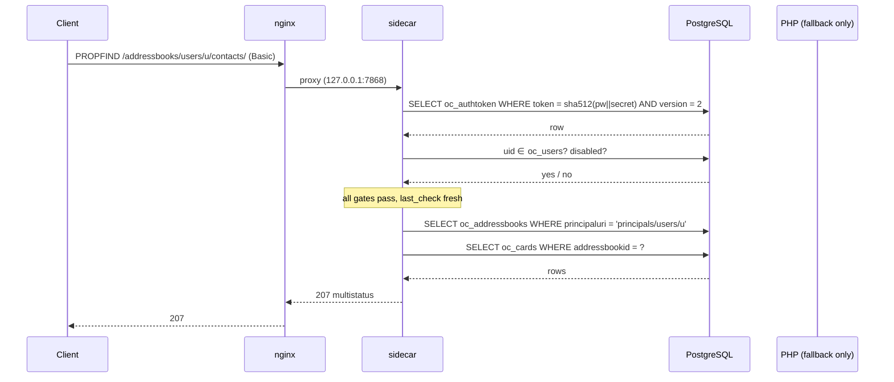

---

## 5. Read path

### 5.1 PROPFIND

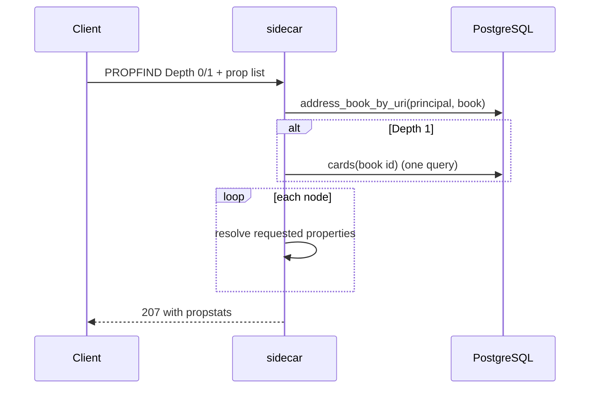

Properties served include `{DAV:}resourcetype`, `displayname`,
`{carddav}addressbook-description`, `{cs}getctag`, `{sabredav}sync-token`,
`{DAV:}sync-token`, `supported-report-set`, `max-resource-size`,
`supported-address-data`, `supported-collation-set`, `owner`,
`current-user-privilege-set`, `{oc}groups`, `{nc}owner-displayname`,
`{nc}has-photo`, and per card `getetag` / `getcontentlength` /
`getlastmodified` / `getcontenttype` / `{carddav}address-data`.

### 5.2 GET

The card body is the raw `oc_cards.carddata`, with the same non-image
`PHOTO:data:` filtering Nextcloud applies on read (`readBlob`), and the stored
ETag quoted. Verified byte-identical to PHP for 40/40 sampled cards.

### 5.3 REPORT

- `addressbook-multiget` — resolve hrefs, one query, 404 propstats for misses.
- `addressbook-query` — RFC 6352 §10.5 filters evaluated in Rust over the
  fetched vCards. `oc_cards_properties` is **not** used as the source of truth
  (it only truncates to 254 bytes and indexes a fixed property list).
- `sync-collection` — RFC 6578, below.

---

### 5.4 WebDAV files `PROPFIND`

`/remote.php/dav/files/<uid>/<path>` `PROPFIND` Depth 0/1 is served natively
from `oc_filecache` (`src/files.rs`), which removes the per-child PHP object
graph and XML cost (~0.127 ms × N) for large listings. It is the same
"authenticate, two indexed queries, serialise a multistatus" shape as CardDAV.

The v1 scope is deliberately narrow, because a files listing is a **filesystem**
view and `oc_filecache` is only one of its sources:

- own home storage only (`oc_storages.id = 'home::<uid>'`, internal path
  `files/<rel>`, resolved by `path_hash = md5(NFC(normalized path))`);
- the app-password fast path only (`AuthMethod::FastPath`);
- no mount at, under, or (as a collection) below the path — mounts come from
  `oc_mounts` and are not children in the home cache;
- every explicitly requested property must be implemented, otherwise **501**.

Anything else — the home root with mounts, a received share, a groupfolder, an
external storage, `/trashbin`, `/versions`, the legacy `/remote.php/webdav/`,
`OPTIONS`, `GET`, every write — answers **501** and nginx replays the buffered
request to PHP. A missing path is a 404, matching Sabre's node resolution.

The property gate is the load-bearing rule: a 404 for a property PHP serves
would make a client believe the value does not exist, so an unknown qname
delegates instead. The implemented set is the exact union of the web UI's and
desktop client's real requests (see `docs/DEVIATIONS.md` § "WebDAV files
PROPFIND"): constants and already-joined columns (`d:creationdate` from
`oc_filecache_extended.creation_time`, `nc:metadata-<key>` and `nc:hidden` from
`oc_files_metadata.json`, `oc:data-fingerprint` from `config.php`,
`ocs:share-permissions`), PHP 404s that are still served natively
(`nc:is-encrypted`, `oc:dDC`, `nc:note`, `nc:hide-download`), and one bulk
`oc_share` query per collection for `oc:share-types` / `nc:sharees`. Anything
left out — `oc:tags`, `nc:system-tags`, `nc:lock*` when `files_lock` is enabled,
`oc:downloadURL` on a primary object store — still delegates with 501. See
`docs/DEVIATIONS.md` for the declared differences (static `nc:has-preview`, the
finite-quota disk-free approximation, the two delegation cases).

The multistatus writer is the CardDAV one (`src/xml/write.rs`): one
`<d:multistatus>` with a parent response followed by children in **database
order** (PHP issues no `ORDER BY`), a trailing slash on collection hrefs, the
200 propstat then the 404 propstat, and `allprop`/`propname` on Sabre's fixed
7-property list.

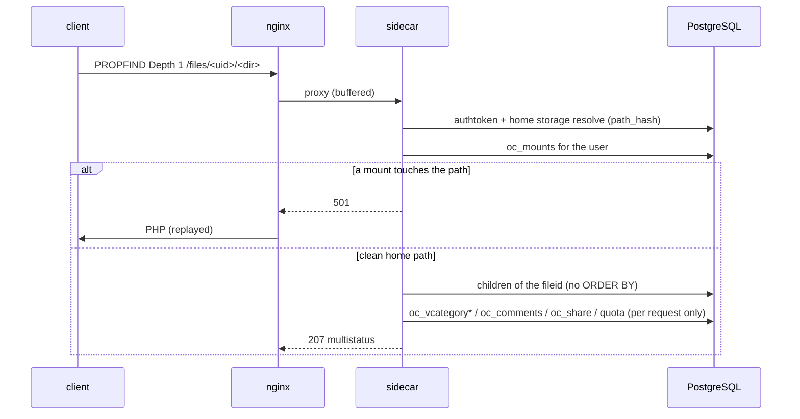

### 5.5 CalDAV calendars

The CalDAV path shape has **no `users/` segment**
(`/remote.php/dav/calendars/<uid>/<cal>/`), so it gets its own parser and
nginx location. Served natively:

- the caller's **calendar home** (`Depth: 0`/`1`) from `oc_calendars` +
  `oc_dav_shares` + `oc_properties`;
- one owned, live **calendar** (`Depth: 0`) with the full property set;
- `sync-collection` and `calendar-multiget` REPORTs on that calendar.

Everything else delegates with **501**: objects (`GET`/`PROPFIND`), `trashbin/`,
`inbox`/`outbox`, subscriptions, federated/app-generated calendars, every other
principal, `calendar-query`, `<cal:expand>`, `application/calendar+json`,
free-busy, `?export`, and all writes. A REPORT on a **shared** or trashed
calendar also delegates, because the shared object post-processing
(`VALARM` stripping, `CONFIDENTIAL` masking, size suppression) is a
parse-and-re-serialise path the sidecar does not reproduce.

The property gate applies per node type: an explicit request whose qname is
outside the implemented/known-404 set delegates, never answers 404. The calendar
`getctag` is the sabre-sync URL (`http://sabre.io/ns/sync/<token>`), while the
CardDAV `getctag` is the raw integer.

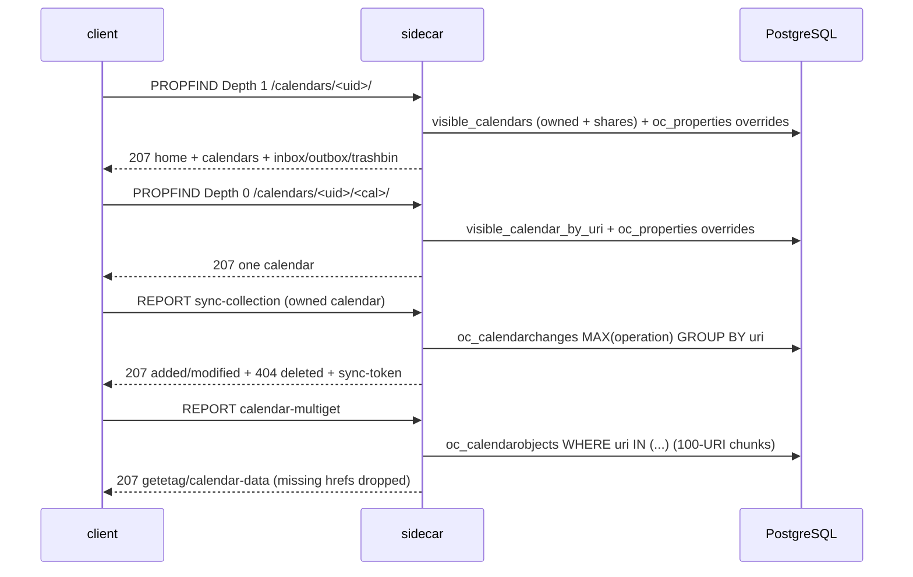

`calendar-data` is the stored blob with every `\r` removed, exactly like
`Sabre\CalDAV\Plugin::propFind()` ("Taking out \r to not screw up the xml
output"), while `{DAV:}getetag` stays `"<stored md5>"` — i.e. the hash is over
the stored CRLF bytes, not the emitted body. `calendar-multiget` drops hrefs
that do not resolve (Sabre's `Tree::getMultipleNodes()`), unlike CardDAV's
synthetic 404 propstats.

## 6. Sync tokens (RFC 6578)

Nextcloud's token scheme is unusual and the sidecar reproduces it exactly:
`oc_addressbooks.synctoken` is always *max(`addressbookchanges.synctoken`)+1*,
and each change row carries the **pre-increment** token. The wire form is
`http://sabre.io/ns/sync/<n>`.

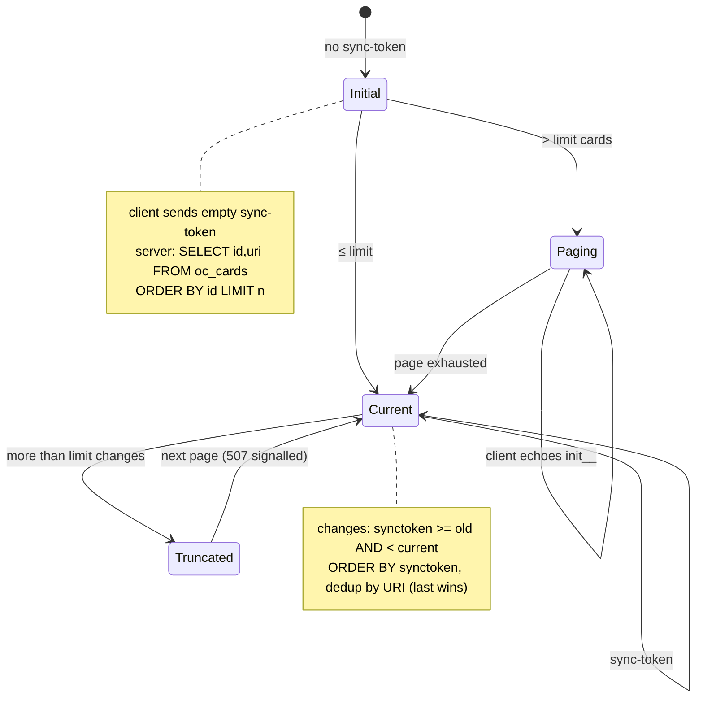

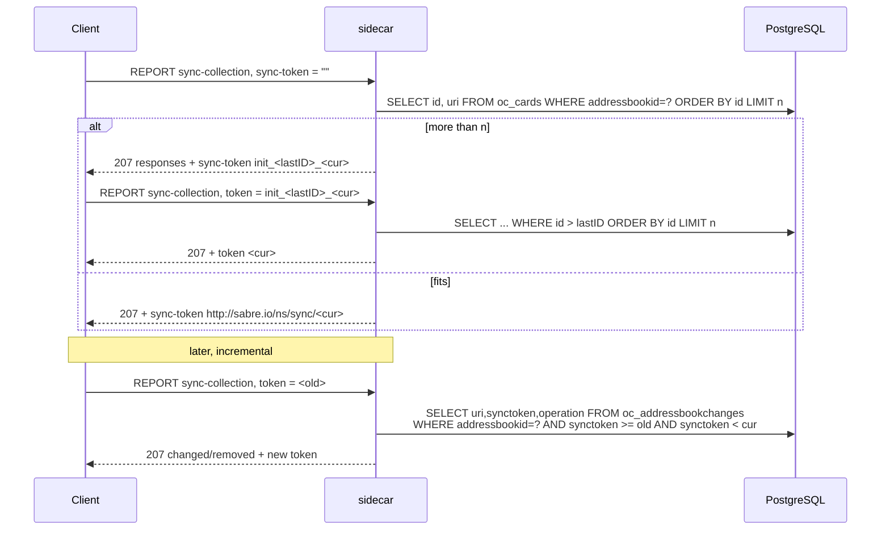

A `507` is emitted when a page is truncated, matching Sabre. A malformed
(token missing the prefix) yields `400`.

### 6.1 CalDAV `sync-collection`

The CalDAV token scheme is the same pre-increment one, but
`CalDavBackend::getChangesForCalendar()` differs from its CardDAV twin in ways
the sidecar reproduces exactly:

- the change query is `SELECT uri, MAX(operation) … GROUP BY uri`, so a URI
  touched add→delete inside one window is reported as a **delete** (3 > 1);
- there is **no `init_` paging** — a non-numeric token (including `init_…`) is
  treated as an initial sync, not an error, and applies the limit;
- the result is **never truncated**: the token is always the calendar's current
  token and no `507` marker is emitted;
- an empty token **with** a `<d:limit>` is `UnsupportedLimitOnInitialSyncException`
  (`507` + `<d:number-of-matches-within-limits/>`);
- Sabre's `SyncCollectionReport` **requires** `<d:sync-token>` and `<d:prop>`,
  so a report missing either is a `400` with a specific message;
- a token missing the prefix is `403` + `<d:valid-sync-token/>`.

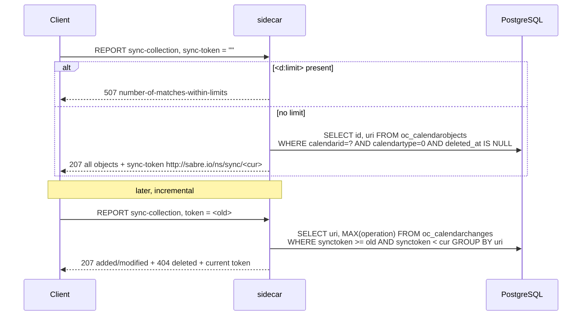

---

## 7. Write path — native, with a transactional outbox

Card `PUT` and `DELETE` are native (`src/db.rs::put_card` / `delete_card`).
Everything else — `MKCOL`, `PROPPATCH`, `MOVE`, `COPY`, `POST`, and any write
to a collection — still answers `501` so nginx replays it to PHP (§7.2).

### 7.1 The write itself

One transaction mirrors `CardDavBackend::createCard` / `updateCard` /
`deleteCard`: `oc_cards`, an `oc_addressbookchanges` row carrying the
**pre-increment** sync token, the `oc_addressbooks.synctoken` bump, and
`oc_cards_properties` (`INDEXED_PROPERTIES`, `TYPE=PREF` → `preferred=1`,
254-byte truncation on a UTF-8 boundary). `If-Match`/`If-None-Match` are
honoured (412), the size limit is `card_size_limit` (403), a duplicate UID on
create is 409, and create/update/delete answer 201/204/404 like Sabre.
Validation is `calcard` plus a server-owned validator (VERSION whitelist, UID
required, FN once, property-name charset, BEGIN/END pairing, control characters,
UTF-8 normalisation, and hard caps on size, logical line length, property count
and parameters). Clean cards are stored **verbatim** — never re-encoded.

### 7.2 The side effects: a transactional outbox

A Rust process cannot run Nextcloud's PHP listeners, so the same transaction
writes one **outbox** row (`oc_dav_event_outbox`) and a transactional
`pg_notify`. The row is the frozen contract with the companion `nextcloud_dav`
app, whose resident worker (`occ dav:event-dispatch`) drains it and dispatches
the real `CardCreatedEvent`/`CardUpdatedEvent`/`CardDeletedEvent` through
Nextcloud's normal dispatcher — so activity, the birthday calendar, the photo
cache, push notifications and the Redis `cloud_id_` DEL all still happen,
**exactly once**, off the request path.

Atomicity is the point: the event and the card commit or roll back together, so
a crash can neither lose the event nor deliver it twice. The `effects` column
freezes which backend owns each effect id, so an effect can later move to a
Rust handler without any possibility of double dispatch.

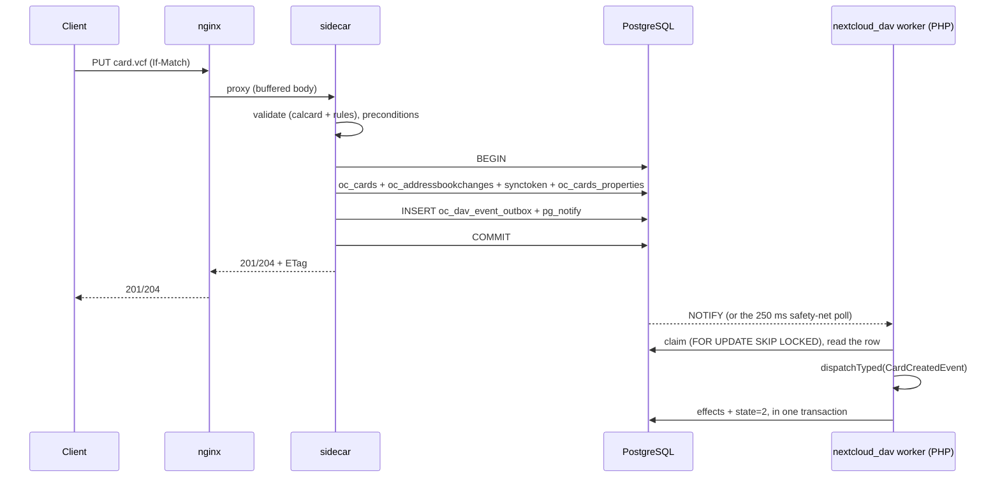

Each row is dispatched in its **own** transaction, so one poison row (a missing
optional app's listener throwing, a malformed `card_row`) retries and
dead-letters alone instead of taking healthy rows with it.

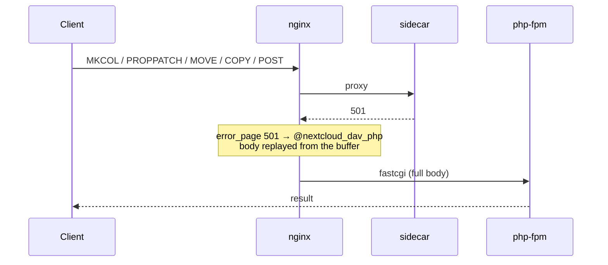

---

## 8. Data model

Only a handful of tables are read. There is **no `oc_principals` table** —
principals are computed from `oc_users` / `oc_group_user` / `oc_accounts`.

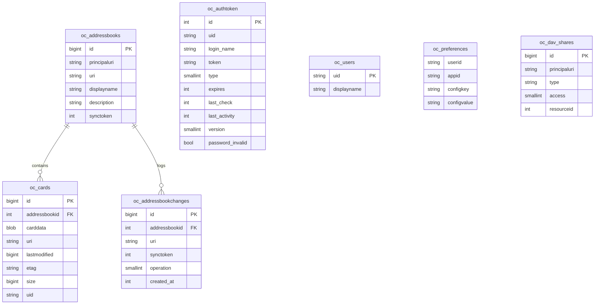

`oc_cards.etag` is an unquoted `md5(carddata)` and is quoted on output.
`oc_cards_properties` exists but is used by Nextcloud's Contacts/OCS search,
**not** by DAV `addressbook-query`.

---

## 9. Caching and consistency

The v1 sidecar holds **no cache**: every request re-reads the DB. That is
deliberate — it is what makes "PHP writes, Rust reads" trivially consistent, and
the queries are indexed (`fs_parent`, `cards_abiduri`, the authtoken unique
index on `token`). The connection pool is the only long-lived state.

The cost of that choice is re-reading rows on every request; the benefit is that
there is no invalidation logic to get wrong and no stale-window on a write.

---

## 10. Failure and fallback behaviour

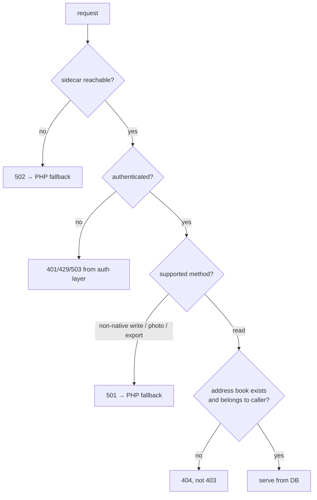

Denied or unknown resources return **404, not 403**, matching Nextcloud's
`DavAclPlugin` (it hides existence). Requests for another user's home/book/card
are rejected before any query, and every query is scoped to
`principals/users/<authenticated uid>`.

---

## 11. What the sidecar deliberately does not do

- `MKCOL`, `PROPPATCH`, `MOVE`, `COPY`, `POST`, and any write to a collection →
  `501` (nginx replays them to PHP). Card `PUT`/`DELETE` *are* native.
- Dispatch the PHP event listeners itself: it queues them (§7.2).
- `?photo` (appdata + GD) and `?export` (concatenated vCard) → `501`.
- The **system** address book and the app-generated `contactsinteraction`
  book → served by PHP (and the home listing always is). Shared books and
  database-backed group shares **are** served (see below).
- jCard (`[`-prefixed) bodies → `415` rather than being converted to vCard, so
  the stored bytes stay byte-identical to what was uploaded.
- vCard 3↔4 negotiation for `address-data`, conditional GET, `allprop`
  completeness → not implemented.
- Brute-force attempt recording → off by default.

### 11.1 Shared and group address books

A book is visible when it is owned (`oc_addressbooks.principaluri =
principals/users/<uid>`), or when an `oc_dav_shares` row of `type =
'addressbook'` targets the caller or one of their **database** groups, and no
`access = 5` tombstone for the caller's principals targets the same
`resourceid`. `Db::visible_books()` returns owned books first, then the shared
rows folded by `oc_addressbooks.id` (read-write beats read-only), ordered by
id:

```sql
SELECT a.id, a.uri, a.displayname, a.principaluri, a.description, a.synctoken, s.access
FROM oc_dav_shares s JOIN oc_addressbooks a ON s.resourceid = a.id
WHERE s.type = 'addressbook'
  AND s.principaluri IN (<caller principal>, <group principals>)
  AND NOT EXISTS (
      SELECT 1 FROM oc_dav_shares d
      WHERE d.access = 5 AND d.resourceid = s.resourceid
        AND d.principaluri IN (<caller principal>, <group principals>))
ORDER BY a.id
```

Group principals come from `oc_group_user`/`oc_groups`, each gid run through
PHP's `urlencode()` (`space → +`, `~ → %7E`, `-_.` unescaped). Every request for
a book or card resolves through this single list, matching the requested name
against the wire URI, so an owned book and a shared book take the same path. A
shared book is served under `<uri>_shared_by_<owner-name>` and a book that is
not visible is a `404`.

| property | owned book | shared, read-write | shared, read-only |
|---|---|---|---|
| `{DAV:}displayname` | `oc_addressbooks.displayname` (fallback `uri`) | `"<displayname> (<owner display name>)"` | same |
| `{DAV:}owner` | `<d:href>/remote.php/dav/principals/users/<caller>/</d:href>` | the **owner's** principal href | same |
| `{nc}owner-displayname` | caller's display name | owner's display name | same |
| `{oc}owner-principal` | absent (404) | `principals/users/<owner>` | same |
| `{oc}read-only` | absent (404) | empty element | `1` |
| `{DAV:}current-user-privilege-set` | full set | full set | `read`, `read-acl`, `read-current-user-privilege-set`, `write-properties` |
| `{carddav}addressbook-description`, `{cs}getctag`, `{sabredav}sync-token`, `{DAV:}sync-token` | owner book columns | owner book columns | same |

A card written into a shared book carries the **owner's**
`oc_addressbooks.id` (the resolved book), exactly like PHP: the card, its
change row, the sync-token bump and the outbox row all land on the owner's
book. If the share is read-only the write is answered **404, never 403**
(Nextcloud's `DavAclPlugin` hides existence from non-owners), with no database
write and no outbox row; reads stay allowed. Three behaviour notes are declared
as deviations: tombstones exclude by `resourceid` (PHP's CardDAV uses `s.id`,
which never hides a surviving group share), group expansion is database-only
(LDAP/circles and `hideFromCollaboration()` are invisible to SQL), and a
shared-book write's activity is attributed to the owner because the outbox has
no actor column.

---

## 12. Operations

**Build and place the binary** (no image distribution, mirrors `notify_push`):

```sh
docker build -t nextcloud-dav:build .
docker create --name ndav nextcloud-dav:build
docker cp ndav:/usr/local/bin/nextcloud-dav ./nextcloud-dav-static
docker rm ndav
kubectl -n nextcloud cp -c nextcloud ./nextcloud-dav-static \
  <pod>:/var/www/html/custom_apps/nextcloud_dav/bin/nextcloud-dav
kubectl -n nextcloud exec <pod> -c nextcloud -- chmod 755 /var/www/html/custom_apps/nextcloud_dav/bin/nextcloud-dav
```

**Restart only the sidecar** after swapping the binary (no pod restart):

```sh
kubectl -n nextcloud exec <pod> -c nextcloud-dav -- kill 1
```

**Pitfalls learned the hard way**

| pitfall | consequence | rule |
|---|---|---|
| kubelet `httpGet` probe on a loopback listener | probe hits the pod IP, fails, CrashLoop | use an `exec` probe (`wget -qO- http://127.0.0.1:7868/healthz`) |
| Deployment strategy is `Recreate` | every manifest change is downtime (~80 s) | prefer binary swap + container restart; schedule changes deliberately |
| ConfigMap change alone | nginx keeps the old config | wait for the kubelet volume sync, then `nginx -s reload` |
| `proxy_request_buffering off` | `error_page` fallback gets an empty body | keep buffering on |
| `^~` prefix location | shadows the PHP location, home listing served by Rust | use the sub-path regex |
| `oc_authtoken` version mismatch | silent PHP fallback, no speed-up | assert the fast path, don't trust 207s |

---

## 13. Measured outcome

Public HTTPS, same credentials, same data, 788-card address book:

| request | PHP | sidecar |
|---|---|---|
| PROPFIND Depth 1 (788 cards) | 1.34–1.41 s | **0.080–0.094 s** |
| PROPFIND Depth 0 (home) | ~1.3 s | **0.030 s** |
| GET card | ~1.3 s | **0.043 s** |
| DAV root, files, calendars | ~1.2 s | unchanged (PHP) |

Content parity: 789 hrefs and 788 ETags identical between backends, 0 differing
values; bodies byte-identical; minified payload differs by 57 bytes (whitespace).

**Known deviation:** for some cards PHP's *GET* returns a weak ETag (`W/"..."`)
while its own *PROPFIND* returns the strong form; the sidecar matches the
PROPFIND form. Bodies are identical. Accepted.

Latency is load-dependent: the same request measured 0.08 s and, under node
memory pressure, 2.18 s (PHP 3.29 s) — the ratio holds, the absolute number
tracks DB I/O contention, not the sidecar.
